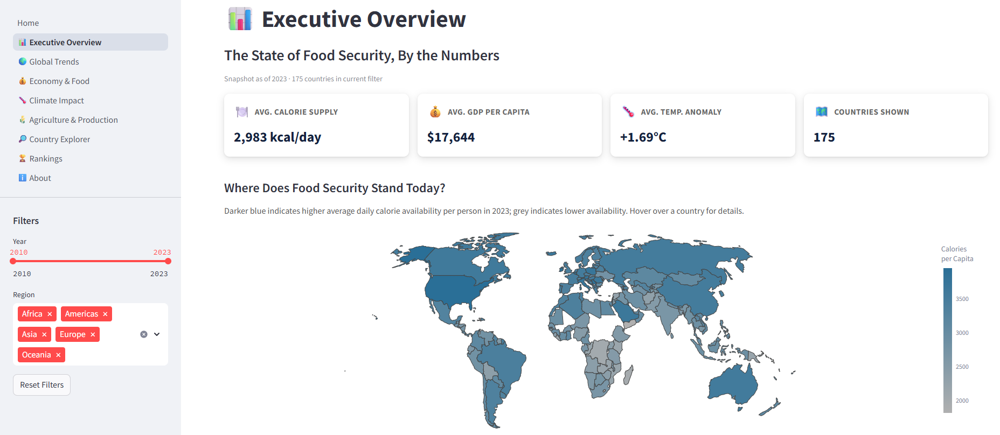
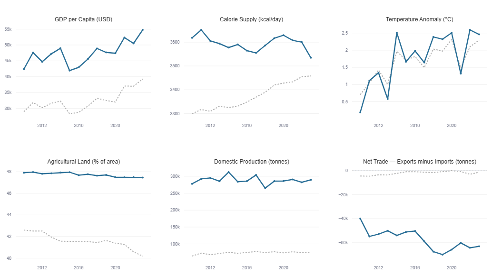

# 🌍 Beyond Economic Growth
### Climate Resilience, Agriculture, and Trade as Drivers of Food Security


**Data Visualization — M.Sc. Data Science Final Project**

**[🔗 Live Dashboard](https://beyond-economic-growth.streamlit.app/)** &nbsp;|&nbsp; **[📊 Presentation](presentation/Beyond_Economic_Growth.pdf)** &nbsp;|&nbsp; **[📓 Notebooks](notebooks/)**

---

## At a Glance

| | | |
|:---:|:---:|:---:|
| **177** | **2010–2023** | **7** |
| Countries | Years Covered | Dashboard Pages |

---

## Project Overview

Economic growth is often viewed as the primary driver of food security. This project investigates whether wealth alone is sufficient to explain food availability across countries.

Using integrated datasets from **FAOSTAT** and the **World Bank**, the analysis explores how **climate change**, **agricultural capacity**, and **trade** contribute to resilient food systems.

The analytical findings are presented through an interactive **Streamlit dashboard**, enabling users to explore global trends as well as country-level insights.

> *Does higher GDP per capita consistently translate into greater food availability — or does resilience depend on more than wealth alone?*

---

## Dashboard Preview

<table>
<tr>
<td width="50%"></td>
<td width="50%"></td>
</tr>
<tr>
<td align="center"><sub>Executive Overview — global KPIs and world map</sub></td>
<td align="center"><sub>Country Explorer — single-country deep dive vs. regional average</sub></td>
</tr>
</table>

**[→ Explore the full live dashboard](https://beyond-economic-growth.streamlit.app/)**

---

## Project Objectives

- Evaluate the relationship between GDP and food availability
- Examine the influence of climate change on food security
- Assess the contribution of agricultural land and food production
- Analyse long-term food security trends
- Develop a composite Food System Resilience Index
- Build an interactive dashboard for exploratory analysis

---

## Data Sources

| Source | Dataset |
|---------|---------|
| FAOSTAT | [Food Balance Sheets](https://www.fao.org/faostat/en/#data/FBS) |
| FAOSTAT | [Temperature Change on Land](https://www.fao.org/faostat/en/#data/ET) |
| World Bank | [GDP per Capita](https://data.worldbank.org/indicator/NY.GDP.PCAP.CD) |
| World Bank | [Population](https://data.worldbank.org/indicator/SP.POP.TOTL) |
| World Bank | [Agricultural Land (%)](https://data.worldbank.org/indicator/AG.LND.AGRI.ZS) |

**Coverage:** 177 countries · 2010–2023

---

## Repository Structure

```text
beyond-economic-growth/
├── Home.py
├── config.py
├── utils.py
├── requirements.txt
├── runtime.txt
├── README.md
│
├── assets/
│   ├── dashboard_preview.png
│   └── country_explorer.png
│
├── pages/
│
├── data/
│   └── processed/
│
├── notebooks/
│   ├── 01_Data_Preparation.ipynb
│   ├── 01_Data_Preparation.html
│   ├── 02_Analytical_Questions.ipynb
│   └── 02_Analytical_Questions.html
│
└── presentation/
    └── Beyond_Economic_Growth.pdf
```

---

## Analytical Framework

The project investigates **twelve analytical questions** organised into four themes:

- **Economy & Prosperity** — AQ1, AQ6, AQ9
- **Climate & Resilience** — AQ2, AQ3, AQ4
- **Agriculture & Trade** — AQ5, AQ7, AQ8
- **Change & Composite Analysis** — AQ10, AQ11, AQ12

---

## Interactive Dashboard

The Streamlit application provides:

- Executive Overview
- Global Trends
- Economy & Food
- Climate Impact
- Agriculture & Production
- Country Explorer
- Rankings

### Dashboard Features

- Interactive sidebar filters (Year, Region)
- Country-level exploration with regional benchmarking
- KPI cards with vs.-regional-average deltas
- Plotly visualisations throughout
- CVD-safe, accessible colour palette
- Responsive layout

---

## Technologies

- Python
- Streamlit
- Plotly
- Pandas
- NumPy
- SciPy

---

## Installation

Clone the repository:
```bash
git clone https://github.com/Anupriya-Segar/beyond-economic-growth
```

Install dependencies:
```bash
pip install -r requirements.txt
```

Run the dashboard:
```bash
streamlit run Home.py
```

---

## Project Deliverables

- Data Preparation Notebook
- Analytical Questions Notebook
- Interactive Streamlit Dashboard
- Final Project Presentation (PDF)

---

## Future Improvements

Potential extensions include:

- Additional climate indicators
- Forecasting models
- Scenario analysis
- Policy simulation
- Automated data updates

---

## Author

**Anupriya Segar**
M.Sc. Data Science — University of Europe for Applied Sciences
Developed for the Data Visualization course, Summer Semester 2026
